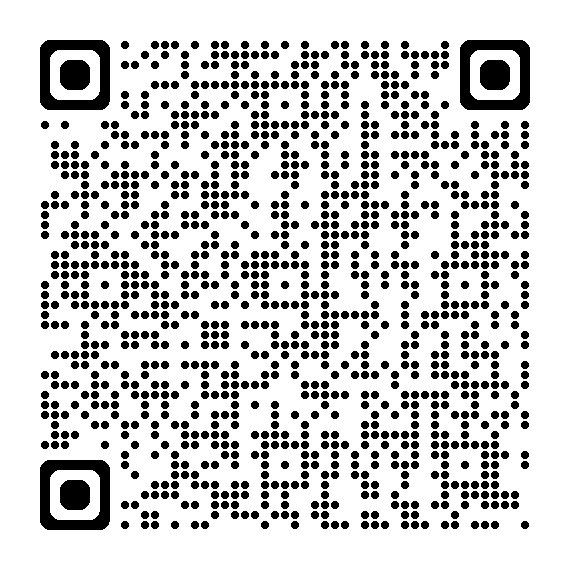

<!--  -->

<!-- 
_class: title timer timer-20 timer-auto
-->

<!-- 
Presenter notes for slide 1
-->

# Title Slide

---

<!-- 
class: timer timer-20 timer-auto
-->

<!-- 
Lunar new year - significant east Asian festival
For example, 
Family reunion, food, gifts, and traditions
-->

# The Lunar New Year

---

<!-- 
Kinh Do is a Vietnamese snack company
Products include biscuits, soft cakes, crackers
Has nothing to do with Tet, but so memorable
Question - when did this started?
-->

# The Kinh Do Case Study

::: dynamic class="absolute left-48 top-16 text-red-500 text-center font-black w-fit bg-white p-2"

seeing
Kinh Do
is seeing
Tet

:::

---

<!-- 
Another thing I remember about Tet is Coke
Again, no relevant to Tet, but still so memorable
When given this task, these are the first two that came to mind
And begin to wonder why
Let's pause here and go back to the basics
-->

# The Coca-Cola Case Study

---

<!-- 
So what is advertising?
- Promoting a product or service
- Various channels
  - Newspapers, magazines,
  - TV, radio, billboards
  - Social media, websites
-->

# So what is advertising?

---

<!-- 
- Inform customers of products
- Establish brand identity
- Increase sales

Did Kinh Do and Coca-Cola achieve these goals? Absolutely!

-->

# Purpose of advertising

---

# 

---

# Slide 7

---

# Slide 8

---

# Slide 9

---

# Slide 10

---

# Slide 11

---

# Slide 12

---

# Slide 13

---

# Slide 14

---

# Slide 15

---

# Slide 16

---

# Slide 17

---

# Slide 18

---

# Social Media

---

> [!CARD W-FIT] 
> 
> The Australian Ad Observatory
>
>  { .w-[50vh] }

