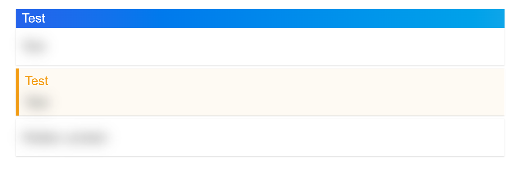

<script src="scripts/hidden-toggle.js"></script>

<!-- 
_class: title
-->

# Title Slide

This is a title slide with some content.

> [!NOTE]
>
> This is a note

<div class="flex gap-2">

> [!CARD] **Title**
>
> This is a card.

> [!CARD] **Title**
>
> This is a card.

</div>


---

# Callouts

Import the `blockquote-callout.js` script to enable callouts, and use `[!NOTE]`, `[!WARNING]`, `[!SUCCESS]`, and `[!QUOTE]` to create callouts.

> [!CALLOUT NOTE]
> 
> This is a note.
> 

> [!CALLOUT WARNING] **WARNING**
>
> This is a warning. **Beware!**
>
> New content here.

> [!CALLOUT SUCCESS]
> 
> Normal Blockquote

> [!CALLOUT QUOTE]
>
> A callout with a quote.

Normal blockquotes are overridden for other uses.

---

# Grid and Flex

Use `tailwind` classes to create a grid.

<div class="grid grid-cols-2 gap-4">

> [!CALLOUT NOTE]
> 
> Block 1
>
> This is a blockquote.

> [!CALLOUT WARNING]
> 
> Block 2
>
> This is another blockquote.

> [!CALLOUT SUCCESS]
> 
> Block 3
>
> This is a third blockquote.

> [!CALLOUT QUOTE]
> 
> Block 4
>
> This is a fourth blockquote.

</div>

Or use `flex` classes to create a flexbox.

<div class="flex flex-row gap-4 flex-wrap">

> [!CALLOUT NOTE]
>
> This is a note.

> [!CALLOUT WARNING]
>
> This is a warning.

> [!CALLOUT SUCCESS]
>
> This is a success message that is rather long and should wrap to the next line. It is so long that the text inside it also wraps to the next line.

</div>

---

# Code Blocks

```js
// This is a code block.

const foo = 'bar';
```

```java
public static void main(String[] args) {
    System.out.println("Hello, world!");
    String foo = "bar";
}
```

---

# Cards

<div class="grid grid-cols-2 gap-4">

> [!CARD] **Title of the card**
>
> This is a card.

> [!CARD SIMPLE] **Another card**
>
> This is another card, without a title (`SIMPLE`).

> [!CARD HIDDEN] **HIDDEN card (click to reveal)**
>
> This is a hidden card. Its content is blurred until hovered over, and then it is revealed.

</div>

---

# Stack

Use `stacked` to stack elements

<div class="stacked flex-col h-20 w-20" style="--stack-gap: -35%">

> [!CARD NOTE] Card 1
>
> This is a note.

> [!CARD WARNING] Card 2
>
> This is a warning.

> [!CARD HIDDEN] Card 3
>
> This is a success message.

</div>

---

> [!CALLOUT CARD HIDDEN] Test
>
> Test

> [!CALLOUT WARNING HIDDEN] Test
>
> Test

> [!CARD HIDDEN]
>
> Hidden content

---

